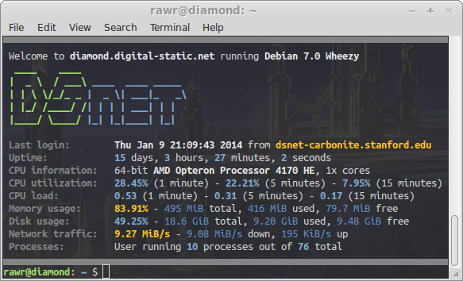

# Message-of-the-Day Generator #

## Introduction ##



This is a custom message of the day (MOTD) designed to be as practical and
informative as possible. The truth is, no one actually reads the MOTD. As such,
the MOTD should contain useful, yet minimal, information about the host system
such that a quick glance at it when logging in may actually be worth a person's
precious time. This way, any potential issues are noticed and not naively
ignored. This MOTD generator scripts has the ability to output text in color.
Using this feature, potential issues can be highlighted for easy identification.

Warnings that can be highlighted:

* The login time if this is the first login since a reboot
* The last login hostname if it differs from the current login hostname
* CPU utilization if it exceeds a threshold
* CPU load if it exceeds a threshold
* RAM usage if it exceeds a threshold
* Disk usage if it exceeds a threshold
* Network load if it exceeds a threshold

Feel free to modify the scripts as you see fit!


## Files ##

* **motd_gen.py**: Script to generate informative MOTD display
* **motd_stat.py**: Statistic gathering daemon for MOTD
* **motd_stat**: Init.d script to start the motd_stat daemon


## Installation ##

```bash
# Be root to install
su

# Download the archive
curl -L https://github.com/dsnet/motd-generator/archive/master.tar.gz | tar -zxv

# Move local copy
SRC_ROOT=/usr/local/motd_gen
mv motd-generator-master $SRC_ROOT

# Setup the daemon service
ln -s $SRC_ROOT/motd_stat /etc/init.d/motd-stat
update-rc.d motd-stat defaults
service motd-stat start

# Nuke old MOTD file
rm /etc/motd
touch /etc/motd

# Prevent other modules from printing redundant information
sed -i -e 's|\(PrintLastLog\s*\)yes|\1no|' /etc/ssh/sshd_config
sed -i -e 's|\(PrintMotd\s*\)yes|\1no|' /etc/ssh/sshd_config
sed -i -e 's|\(^\s*session.*pam_mail.so\)|#\1|' /etc/pam.d/*
sed -i -e 's|\(^\s*session.*pam_motd.so\)|#\1|' /etc/pam.d/*
sed -i -e 's|\(^\s*session.*pam_lastlog.so\)|#\1|' /etc/pam.d/*
/etc/init.d/ssh restart

# Print the custom MOTD upon every login
echo -e "
if [ -e $SRC_ROOT/motd_gen.py ]; then
\tif [ -x /usr/bin/dircolors ]; then
\t\t$SRC_ROOT/motd_gen.py --color --warn --border
\telse
\t\t$SRC_ROOT/motd_gen.py --border
\tfi
fi" >> /etc/profile
```
